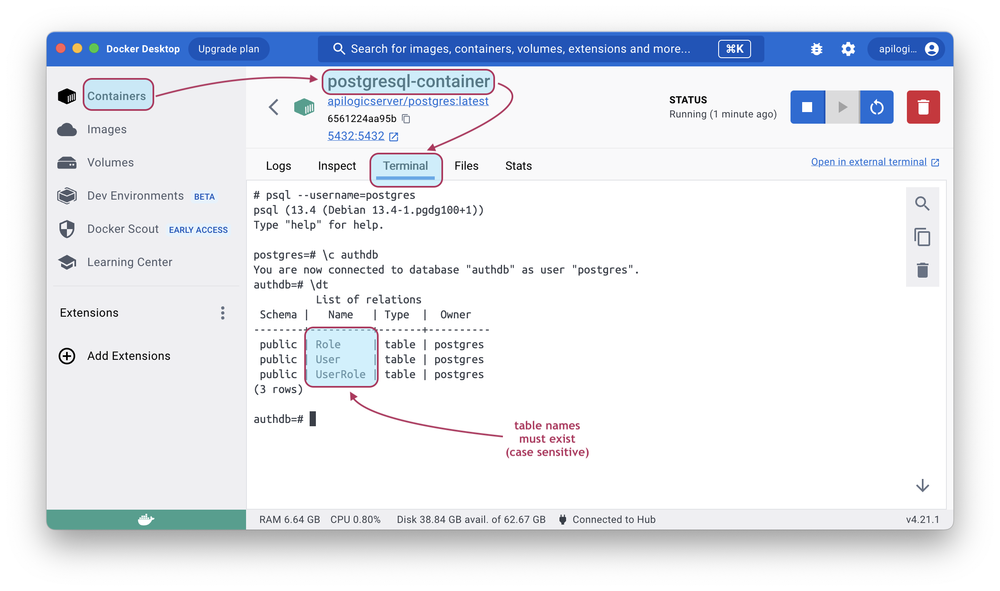
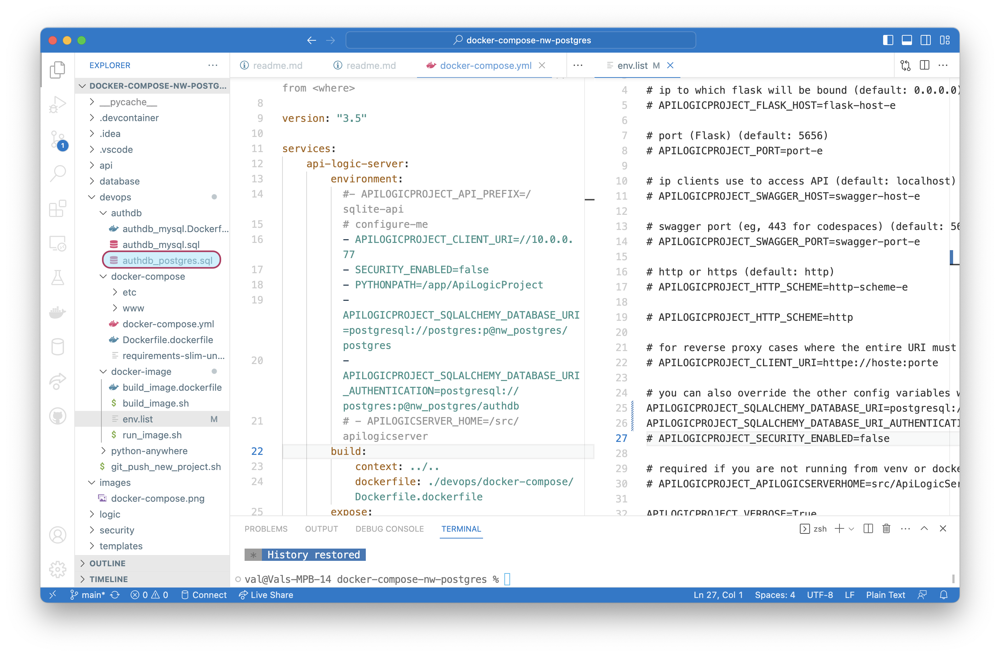

# Postgres ApiLogicProject using Docker and docker-compose

This project illustrates using API Logic Server with Docker and docker-compose.  The objective is to provide a simple way to explore using docker with API Logic Server on your local machine.  These are *not* production procedures - they are designed for simple local machine operation.

The git project is an uncustomized API Logic Project created from the postgres Northwind database image.  This database is provided in a docker container:

```bash
docker run -d --name postgresql-container --net dev-network -p 5432:5432 -e PGDATA=/pgdata -e POSTGRES_PASSWORD=p apilogicserver/postgres:latest
```

This doc explains:

* **I. Running the git project as an *image*** - acquire pre-created project from git, and run

* **II. Running the git project as a *docker-compose*** - build, deploy and run

* **III. Recreating the project** - how to rebuild the project from scratch

* **IV. Status, Open Issues (eg, not working on windows)** 


We presume you have Python,  `pip installed` ApiLogicServer (version >= 09.01.25 - [preview here](https://apilogicserver.github.io/Docs/#preview-version)), and docker.

&nbsp;

&nbsp;

# General Setup

Stop the docker-compose container, if it is running.

&nbsp;

## 1. Install API Logic Server

Install the current (or [preview](https://apilogicserver.github.io/Docs/#preview-version)).  Use the `ApiLogicServer` command to verify the version note above.

&nbsp;

## 2. Create the postgres database container:

The image contains not only Postgres, but also the `Northwind` and `authdb` databases.

```bash
docker run -d --name postgresql-container --net dev-network -p 5432:5432 -e PGDATA=/pgdata -e POSTGRES_PASSWORD=p apilogicserver/postgres:latest
```

&nbsp;

## 3. Install this project from git

Follow this procedure to obtain the *pre-created* project from git.

```
# git clone https://github.com/ApiLogicServer/docker-compose-nw-postgres.git
# cd docker-compose-nw-postgres
```

&nbsp;

## 4. Verify local operation

Verify proper installation:

1. Open the project in VSCode

2. Establish your (possibly preview) virtual environment

3. Press F5 to run the server

4. Run the [Admin App](http://localhost:5656), and Swagger

&nbsp;

## Obtain the web app

The git project does not store these files, so you must obtain them:

```bash
pushd devops/docker-compose
sh install-webapp.sh
popd
```

&nbsp;

&nbsp;

# I. Running the git project as image

&nbsp;

## 1. Build the Image

> For preview versions, verify `devops/docker-image/build_image.dockerfile` is using `apilogicserver/api_logic_server_x` (note the *_x*).

&nbsp;

```bash
cd <project>
sh devops/docker-image/build_image.sh .
```

&nbsp;

## 2. Start the database

First, if you haven't already done so, start the database:

```bash
docker run -d --name postgresql-container --net dev-network -p 5432:5432 -e PGDATA=/pgdata -e POSTGRES_PASSWORD=p apilogicserver/postgres:latest
```

&nbsp;

## 3. Configure the server

When run from a container, the database uri using `localhost` (from [ApiLogicServer create](#2-create-the-project)) does not work.  Observe the [`devops/docker-image/env.list`](devops/docker-image/env.list):

```
APILOGICPROJECT_SQLALCHEMY_DATABASE_URI=postgresql://postgres:p@postgresql-container/postgres
APILOGICPROJECT_SQLALCHEMY_DATABASE_URI_AUTHENTICATION=postgresql://postgres:p@postgresql-container/authdb
```

&nbsp;

## 4. Start the Server

Use the pre-created command line script:

```bash
sh devops/docker-image/run_image.sh
```

&nbsp;

## 5. Run the App

Run the [Admin App](http://localhost:5656), and Swagger.

You can also run the [Authentication Administration App](http://localhost:5656/admin/authentication_admin/) to define users and roles (though not required).

&nbsp;

&nbsp;

# II. Running the git project as docker-compose

&nbsp;

## 1. Stop the docker database

The procedure below will spin up *another* database container.

Ensure you are not already running the API Logic Server postgres database in a docker container.  If it's running, you will see port conflicts.

&nbsp;

## 2. Build, Deploy and Run

The following will build, deploy and start the container stack locally:

```
# cd ./devops/docker-compose/
# sh docker-compose.sh     # windows: .\docker-compose.ps
```

Then, in your browser, open [`localhost`](http://localhost).

&nbsp;

### Manual Port configuration

If that fails (e.g., windows), enter your port into [`devops/docker-image/docker-compose.yml`](./devops/docker-compose/docker-compose.yml).

Then, use the following to build, deploy and start the default container stack locally:

```
# cd postgres-docker-compose  # <project-root>
# docker-compose -f ./devops/docker-compose/docker-compose.yml up
```

Then, in your browser, open [`localhost`](http://localhost).

&nbsp;

## 3. Add Security

The postgres database contains `authdb`.  To activate security, update [`devops/docker-compose/docker-compose.yml`](devops/docker-compose/docker-compose.yml):

1. Set `- SECURITY_ENABLED=true`

2. Under api-logic-server-environment, observe:

`          - APILOGICPROJECT_SQLALCHEMY_DATABASE_URI_AUTHENTICATION=postgresql://postgres:p@nw_postgres/authdb
`

&nbsp;

&nbsp;

# III. Recreating the Project

After verifying project operation using the instructions above, you may wish to re-create the project from scratch.

Re-create this project as follows:

&nbsp;

## 0. Setup

Stop the docker-compose container, if it is running.

&nbsp;

## 1. Start the postgres database container:

```bash
docker run -d --name postgresql-container --net dev-network -p 5432:5432 -e PGDATA=/pgdata -e POSTGRES_PASSWORD=p apilogicserver/postgres:latest
```

Verify it looks like this:




&nbsp;

## 2. Create the Project:

Create the project with API Logic Server in the directory indicted below, as a sibling of this project obtained from github:

```bash
cd <parent folder to this project>
ApiLogicServer create --project_name=rebuild-docker-compose-nw-postgres --db_url=postgresql://postgres:p@localhost/postgres
```



&nbsp;

## 3. Verify proper operation

The project should be ready to run without customization:

1. Open the project in VSCode

2. Establish your (possibly preview) virtual environment

3. Press F5 to run the server

4. Run the [Admin App](http://localhost:5656), and Swagger

&nbsp;

## 4. Add Security - using the terminal window inside VSCode:

**Stop the server.**

Using the terminal window **inside VSCode:**

```bash
ApiLogicServer add-auth --project_name=. --db_url=postgresql://postgres:p@localhost/authdb
```
Re-run the project (F5), observe you need to login.  Observe further that **u1** does not work - you need to use ***admin***.

&nbsp;

## 5. Obtain the web app

The git project does not store these files, so you must obtain them:

```bash
pushd devops/docker-compose
sh install-webapp.sh
popd
```

You have now recreated the git project.  You should be able to execute the instructions at the [top of this page](#i-running-the-git-project-as-image).

&nbsp;

&nbsp;

# IV. Status, Open Issues

This procedure has been validated on several computers, in all aspects described above.

&nbsp;

## Production Considerations

As noted above, this project is provided to explore docker / API Logic Server in a simple, local environment.  Production considerations:

1. Instead of building the app image, you might prefer to built it separately and use *that* in the docker-compose, e.g.

```bash
services:
    api_logic_project:
        container_name: apilogicserver/docker-compose-nw
        network_mode: dev-network
        env_file:
            - 'env.list'
```

2. Database data is **in the image** to simplify installs.  You would typically use volumes for data in production.

&nbsp;

## Open Issues

We are investigating the following improvements (comments requested):
&nbsp;

### 1. Not running under windows

The server builds, starts, and connects to the database.  The web app, however, fails to start in the browser.

&nbsp;

### 2. `www/admin-app`

This is now obtained through an install step.  Please report issues / reactions.

